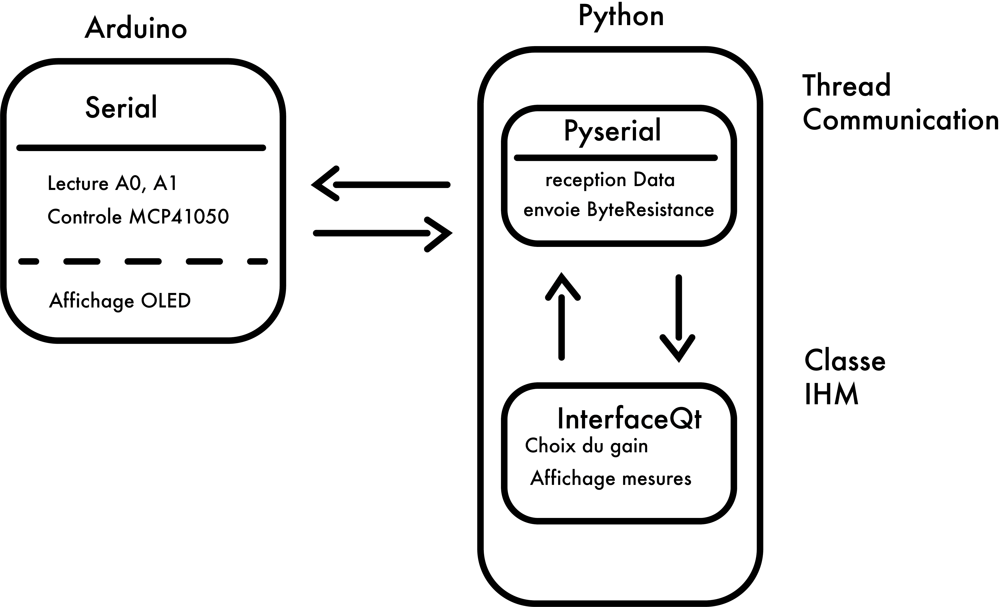
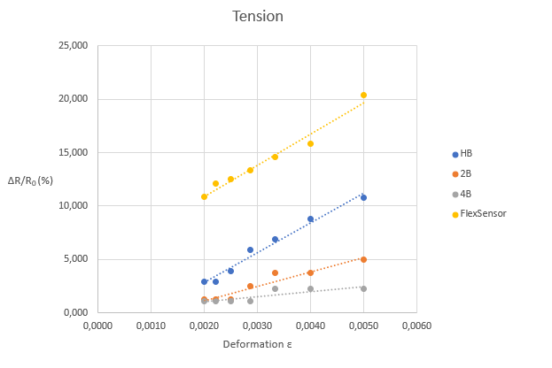

<h1 align = "center"> Projet Capteur Graphite 4A - GP <h1> 
<h2 align="center"> Par NOBLET Thomas </h2>
<h3 align="center"> INSA de Toulouse, département Génie Physique, année 2024 - 2025 </h3>
  

  

## <h2 align = "center"> Mesure de contrainte sous arduino & python d'un capteur graphite <h1>

### 1. Description

*Contexte*

Le projet consiste à reproduire une technologie low-tech de capteur de flexion en graphite, se basant sur l'article "Pencil Drawn Strain Gauges and Chemiresistors on Paper" de Cheng-Wei Lin, Zhibo Zhao, Jaemyung Kim & Jiaxing Huang.

*Principe*

Des traces de crayons sur du papier se comportent comme des résistances dont la valeur varie en fonction de la courbure du papier sur lequel elles sont dessinées. 

*Contenu du projet*

Une [datasheet du capteur](05_DataSheet/Graphite_Sensor_DATA_SHEET.pdf) a pu être réalisée à l'aide d'une carte Arduino Uno, d'un circuit d'amplification (dont le PCB a été réalisé sur KICAD) et d'une interface python.

***Matériel utilisé (non exhaustif)***
- **Capteur de contrainte en graphite** : Mine HB conseillée
- **LTC1050** : Amplificateur du circuit 
- **MCP 41050** : Permet de faire varier le gain du circuit d'amplification
- **Module Bluetooth HC-05** : Récupérer les données en Bluetooth  
- **Ecran OLED SS1306 en I2C** : Affichage des données sur le PCB

### 2. Circuit d'amplification & PCB

Le circuit d'amplification utilise un amplificateur LTC1050 avec un gain de R2/R1. La résistance R1 est un potentiomètre MCP41050 (de 125Ω à 50kΩ) donnant une plage de gain de 2 à 800.

  

<em>Figure 1 : Schéma Amplification </em>

  

<em>Figure 2 : Circuit réel </em>

Le PCB utilisé est celui-ci, avec les pins Rx et Tx de l'arduino connectées au HC05 (PCB Incorrect). Cette configuration est utilisable si on souhaite uploader le code arduino directement en bluetooth, mais il faut impérativement utiliser les pins 2 et 3 pour un upload depuis le port USB. Les pins 0 et 1 sont également utilisées par la liaison série vers un PC, ce qui provoque des erreurs en utilisant la connexion bluetooth sur ce port.

  

<em>Figure 3 : PCB Incorrect </em>

En l'occurence, aucun des codes python et arduino fournis fonctionnera durablement avec le premier PCB (30s), une erreurs série arrivera relativement rapidement, le PCB a donc été modifié à l'aide de câble pour correspondre à ce nouveau PCB. 

  

<em>Figure 4 : PCB Corrigé</em>

### 3. Interface & code Python 

L'architecture du code est décrite si dessous. La valeur de la résistance ainsi que l'affichage des mesures se fait directement depuis l'interface Qt, qui communique avec un thread gérant l'acquisition et l'envoie de données vers l'arduino qui les réceptionnes. Le code fonctionne à la fois en liaison série et bluetooth, il suffit de choisir depuis "Port choice".

Une valeur du gain observé est affichée dans l'interface, mais ne permet que d'obtenir un ordre de grandeur, la sensibilité des mesures sur l'arduino étant de 4,88 mV et le signal d'entrée trop faible (d'où l'intérêt du circuit d'amplification).

  

<em>Figure 5 : Architecture du code</em>

  

<em>Figure 5 : Interface Qt</em>

Le "run" permet de lancer le stockage des données reçues, mais écrase la précédente série réalisée, il faut donc sauvegarder directement après la fin de l'acquisition si le but est de prendre plusieurs séries d'affilée. 

### 4. Résultats

Les mesures ont été effectuées à l'aide de demi-cylindres de diamètre **D** de **2, 2.5, 3, 3.5, 4, 4.5 et 5 cm** ainsi que de crayons de mines HB, 2B et 4B.
Avec la déformation $\epsilon$ = e/D, e étant l'épaisseur du papier (0,1 mm).

  

<em>Graphique 1 : Réponse en compression</em>

  

<em>Graphique 2 : Réponse en détente</em>

On remarque que la variation de résistance en compression et en détente est plus importante pour une mine moyennement dure et grasse (HB) que pour des mines plus grasses (2B, 4B).

  

<em>Graphique 3 : Comparaison avec un Flex sensor  </em>

En comparant avec un flex sensor de Spectra Symbol, on remarque que la réponse en détente est assez cohérente avec celle du capteur en graphite produit (le flex sensor de Spectra Symbol ne permet pas de comparer en compression, [Datasheet](06_Other/FLEX_SENSOR_-_SPECIAL_EDITION_DATA_SHEET.pdf)). De plus, les mesures on étés prises sans utiliser le circuit d'amplification. 

### 5. Limites et perspectives

*Le Bluetooth du HC-05*

  La connexion entre le module HC-05 et un PC est **trop instable** pour utiliser seulement l'interface python fournie **sur Mac OS**, l'appairage échoue souvent ou se coupe régulièrement. Il est préférable d'utiliser une connexion avec un port série. 
  
*Utilisation d'un module Wifi ESP32*

  Remplacer le HC-O5 par un module Wifi ESP32 pourrait permettre de se connecter plus aisément avec les OS Mac sur un même réseau et également en bluetooth. 
  
